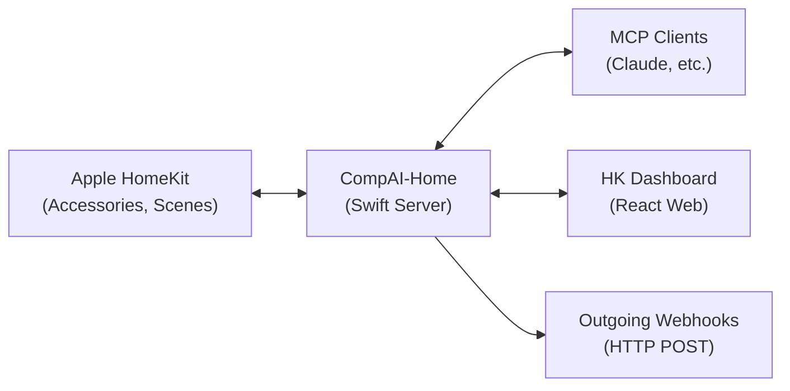
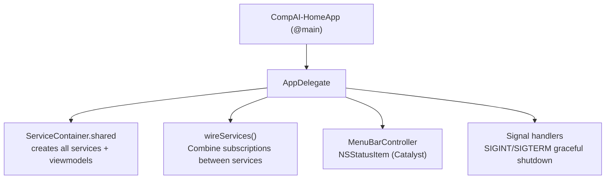
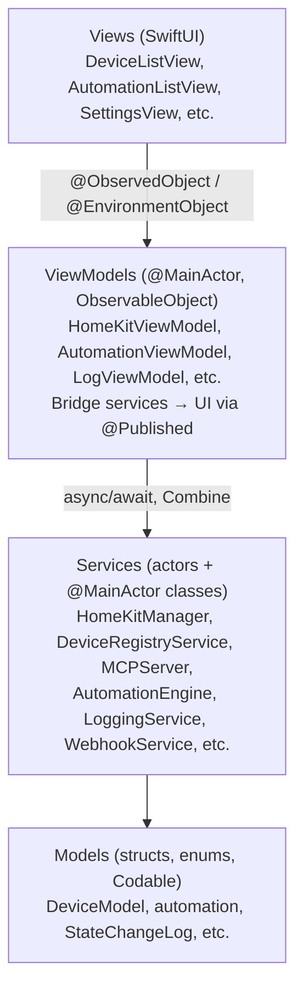
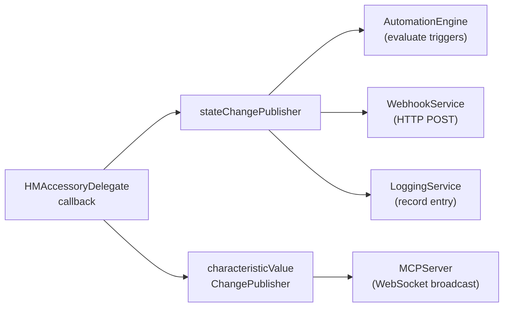
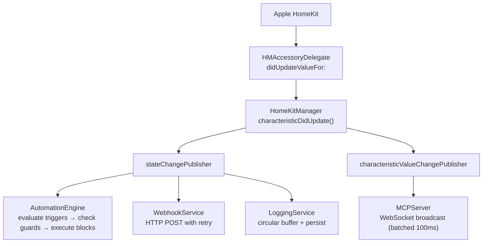
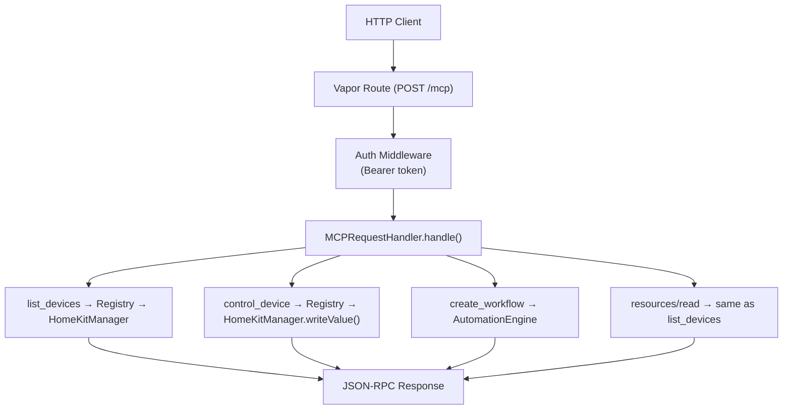
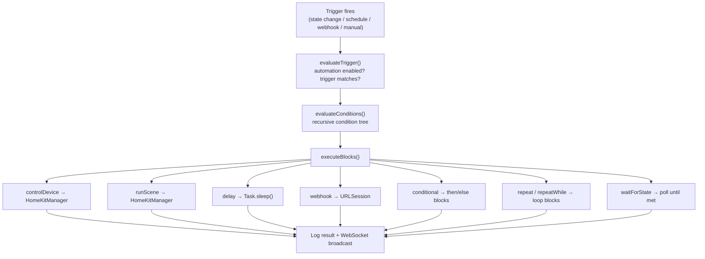
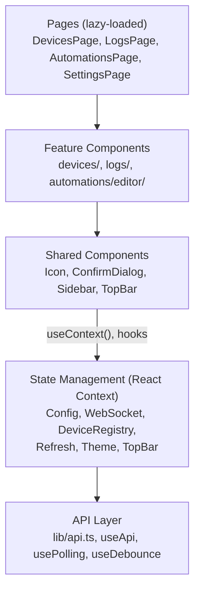
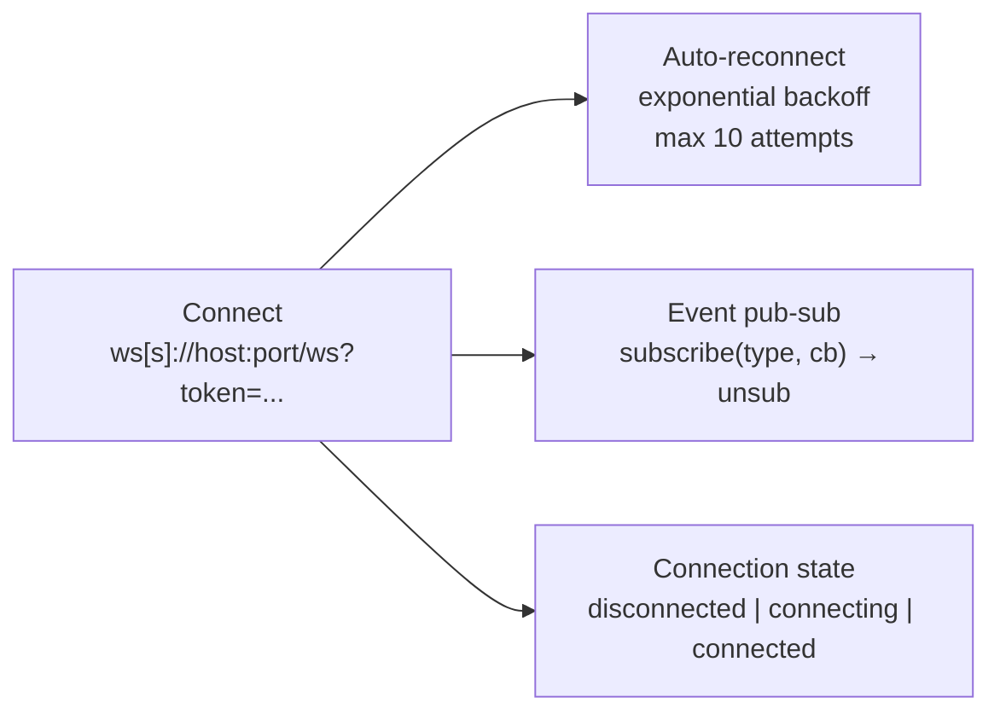

# CompAI - Home — Engineering Design Document

## Table of Contents

- [1. System Overview](#1-system-overview)
- [2. Swift Server Application (CompAI-Home)](#2-swift-server-application-compai-home)
- [3. Web Application (HK Dashboard)](#3-web-application-hk-dashboard)
- [4. Cross-Cutting Concerns](#4-cross-cutting-concerns)
- [5. Directory Structure](#5-directory-structure)

---

## 1. System Overview

CompAI - Home is a two-application system that bridges Apple HomeKit with external clients — AI assistants, web dashboards, and HTTP integrations.



**Swift Server (CompAI-Home)** — A macOS Mac Catalyst menu bar application. It connects to Apple HomeKit via `HMHomeManager`, maintains a stable device registry, exposes devices through REST and MCP protocol endpoints, runs an automation engine, and broadcasts real-time updates over WebSocket.

**Web Application (HK Dashboard)** — A React SPA that connects to the Swift server's REST API and WebSocket. Provides device browsing, activity log viewing, visual automation editing with drag-and-drop, and settings configuration.

### Communication Protocols

| Protocol | Direction | Transport | Purpose |
|----------|-----------|-----------|---------|
| REST API | Client → Server | HTTP | CRUD operations on devices, scenes, logs, automations |
| MCP JSON-RPC | AI Client → Server | HTTP (Streamable / SSE) | AI tool use — query and control HomeKit |
| WebSocket | Server → Client | WS | Real-time push of state changes, logs, automation events |
| Outgoing Webhook | Server → External | HTTP POST | Notify external services of state changes |
| HomeKit | Server ↔ Apple | HMHomeManager | Device discovery, monitoring, control |

---

## 2. Swift Server Application (CompAI-Home)

### 2.1 Tech Stack

| Component | Technology |
|-----------|-----------|
| Platform | Mac Catalyst (iOS app running on macOS) |
| Language | Swift 5.9+, minimum macOS 13.0 (Ventura) |
| UI | SwiftUI with MVVM pattern |
| HTTP Server | Vapor 4.x |
| Reactive | Combine (PassthroughSubject, @Published) |
| Concurrency | Swift actors, async/await |
| HomeKit | Apple HomeKit framework (HMHomeManager, HMAccessoryDelegate) |
| Build | XcodeGen (project.yml → .xcodeproj), Swift Package Manager |
| Distribution | Non-sandboxed, direct download (notarized) |

### 2.2 Application Lifecycle

The app runs as a **menu bar agent** (`LSUIElement = true`) with no Dock icon.



**ServiceContainer** acts as a dependency injection container. All services are created as lazy singletons. `wireServices()` connects cross-service Combine pipelines after initialization (e.g., HomeKitManager state changes → AutomationEngine triggers).

**Build Configurations:**

| Configuration | Scheme | Flag | Notes |
|---------------|--------|------|-------|
| Dev Debug | CompAI-Home | `DEV_ENVIRONMENT` | Auto-accepts `dev-token-compai-home` |
| Dev Release | CompAI-Home | `DEV_ENVIRONMENT` | Optimized dev build |
| Prod Debug | CompAI-Home-Prod | — | Real Keychain tokens required |
| Prod Release | CompAI-Home-Prod | — | Distribution build |

### 2.3 Architecture Layers



**Concurrency model:**
- **Actors**: DeviceRegistryService, AutomationEngine, LoggingService, WebhookService, AutomationStorageService — thread-safe by isolation
- **@MainActor**: HomeKitManager, StorageService, ViewModels — UI-bound, HomeKit API requires main thread
- **Nonisolated**: Combine publishers on actor services exposed as `nonisolated let` for zero-await subscription

### 2.4 Core Services

#### HomeKitManager

The primary bridge to Apple HomeKit. Wraps `HMHomeManager` and implements `HMAccessoryDelegate`.

**Responsibilities:**
- Device discovery via `homeManagerDidUpdateHomes(_:)`
- Real-time state monitoring via `accessory(_:service:didUpdateValueFor:)`
- Device control (write characteristic values)
- Scene listing and execution
- Hardware identity extraction (manufacturer, model, serial number, firmware)
- Cached device/scene model rebuilding for O(1) lookups

**Key properties:**
```swift
@Published var homes: [HMHome]
@Published var allAccessories: [HMAccessory]
@Published var cachedDevices: [DeviceModel]       // Rebuilt on any change
@Published var cachedScenes: [SceneModel]

let stateChangePublisher: PassthroughSubject<StateChange, Never>
let characteristicValueChangePublisher: PassthroughSubject<CharacteristicValueChange, Never>
```

**State change fan-out:** When a HomeKit characteristic updates, HomeKitManager publishes through `stateChangePublisher`. Multiple subscribers react:



#### DeviceRegistryService

Actor that maintains **stable, persistent device IDs** that survive HomeKit re-pairing, bridge replacements, and accessory resets.

**ID Resolution Strategy (3-level matching):**

```
1. HomeKit UUID match  →  exact match to previously seen device
2. Hardware key match  →  "manufacturer:model:serialNumber" composite
3. Name + Room match   →  fallback for devices without hardware identity
```

**Registry structure:**
```swift
actor DeviceRegistryService {
    // Persistent entries (saved to device-registry.json)
    struct DeviceRegistryEntry {
        let stableId: String                    // App-generated UUID, never changes
        var homeKitId: String?                  // Current HM UUID (can change)
        var hardwareKey: String?                // "mfr:model:sn"
        var name: String
        var roomName: String?
        var services: [ServiceRegistryEntry]
        var isResolved: Bool                    // Currently matched to a HomeKit device
    }

    struct CharacteristicRegistryEntry {
        let stableCharacteristicId: String
        var homeKitCharacteristicId: String?
        var characteristicType: String
        var enabled: Bool                       // Visible in API responses
        var observed: Bool                      // Actively monitored (WebSocket, webhooks, triggers)
    }

    // Thread-safe lookup tables (nonisolated, updated atomically)
    // Allow O(1) resolution without awaiting actor
    nonisolated let stableToHomeKit: AtomicDictionary<String, String>
    nonisolated let homeKitToStable: AtomicDictionary<String, String>
}
```

**Key operations:**
- `syncDevices(_:)` — Called when HomeKit updates; reconciles real devices with registry
- `stableDevices(_:)` — Transforms HomeKit models into registry-filtered models (applies enabled/observed)
- `readHomeKitDeviceId(_:)` / `readStableDeviceId(_:)` — Bidirectional ID resolution
- `updateCharacteristicSettings(enabled:observed:)` — Toggle external visibility

#### MCPServer

Vapor 4.x HTTP server exposing three protocol surfaces from a single port.

**Transport layers:**

| Endpoint | Protocol | Spec |
|----------|----------|------|
| `POST /mcp` | MCP Streamable HTTP | 2025-03-26 |
| `GET /mcp` | MCP Poll (streamable) | 2025-03-26 |
| `DELETE /mcp` | Close MCP session | 2025-03-26 |
| `GET /sse` + `POST /messages` | MCP Legacy SSE | 2024-11-05 |
| `GET /ws` | WebSocket | Real-time push |
| `GET,POST,PATCH,PUT,DELETE /...` | REST API | Standard HTTP |

**MCPRequestHandler** — Stateless handler that processes MCP JSON-RPC requests. All properties are `let` (immutable references to services). Routes `tools/call` to the appropriate service method, applies registry filtering (stable IDs, enabled settings), and handles temperature unit conversion.

**REST API Endpoints:**

| Method | Path | Purpose |
|--------|------|---------|
| `GET` | `/health` | Health check (no auth) |
| `GET` | `/devices` | List all enabled devices |
| `GET` | `/devices/:deviceId` | Single device by stable ID |
| `PATCH` | `/services/:serviceId` | Rename a service |
| `GET` | `/scenes` | List all scenes |
| `GET` | `/scenes/:sceneId` | Single scene |
| `POST` | `/scenes/:sceneId/execute` | Execute a scene |
| `GET` | `/logs` | Filtered, paginated logs |
| `DELETE` | `/logs` | Clear all logs |
| `GET` | `/automations` | List all automations |
| `POST` | `/automations` | Create automation |
| `GET` | `/automations/:id` | Get automation definition |
| `PUT` | `/automations/:id` | Update automation |
| `DELETE` | `/automations/:id` | Delete automation |
| `POST` | `/automations/:id/trigger` | Trigger automation manually |
| `GET` | `/automations/:id/logs` | automation execution history |
| `POST` | `/automations/generate` | AI-generate automation from prompt |
| `POST` | `/automations/webhook/:token` | Webhook-triggered automation |
| `GET` | `/settings/temperature-unit` | Get temperature unit |
| `PATCH` | `/settings/temperature-unit` | Set temperature unit |

**MCP Tools (18):**

| Category | Tools |
|----------|-------|
| Device | `list_devices`, `get_device_details`, `control_device`, `list_rooms`, `get_devices_by_type` |
| Scene | `list_scenes`, `execute_scene` |
| Log | `get_logs` |
| automation | `list_automations`, `get_workflow`, `create_workflow`, `update_workflow`, `delete_workflow`, `enable_workflow`, `trigger_workflow`, `get_workflow_logs` |
| Metadata | `list_device_categories`, `get_workflow_schema` |

**WebSocket Events (server → client):**

| Event Type | Payload | Trigger |
|------------|---------|---------|
| `connected` | — | Client connects |
| `log` | StateChangeLog | New log entry created |
| `automation_log` | WorkflowExecutionLog | automation execution started |
| `automation_log_updated` | WorkflowExecutionLog | automation execution completed/failed |
| `automations_updated` | — | automation definitions changed |
| `devices_updated` | — | Device structure changed |
| `characteristic_updated` | `{deviceId, serviceId, characteristicId, value}` | Observed characteristic changed (batched 100ms) |
| `logs_cleared` | — | All logs cleared |
| `pong` | — | Response to client ping |

#### AutomationEngine

Actor that orchestrates automation. Evaluates triggers, checks conditions, and executes blocks.

**automation structure:**
```swift
struct automation {
    let id: UUID
    var name: String
    var isEnabled: Bool
    var triggers: [AutomationTrigger]           // What fires the automation (OR logic)
    var conditions: [AutomationCondition]?      // Guards before execution (AND logic)
    var blocks: [AutomationBlock]               // Actions to execute (sequential)
    var continueOnError: Bool
    var retriggerPolicy: ConcurrentExecutionPolicy
    var metadata: WorkflowMetadata
}
```

**Trigger types:**

| Type | Description |
|------|-------------|
| `deviceState` | Fires when an observed characteristic changes (equals, transitioned, threshold) |
| `schedule` | Cron-like scheduling (once, daily, weekly, interval) |
| `sunEvent` | Sunrise/sunset with offset (uses SolarCalculator) |
| `webhook` | External HTTP POST to `/automations/webhook/:token` |
| `manual` | Triggered via API or UI |

**Condition types (recursive tree):**

| Type | Description |
|------|-------------|
| `deviceState` | Current value of a characteristic (comparison operators) |
| `timeCondition` | Current time within a range or day/night check |
| `and` / `or` / `not` | Logic operators for compound conditions |

**Block types (indirect enum for recursion):**

| Block | Kind | Description |
|-------|------|-------------|
| `controlDevice` | action | Set a characteristic value |
| `runScene` | action | Run a HomeKit scene |
| `delay` | flowControl | Wait N seconds |
| `webhook` | action | HTTP request (any method) |
| `log` | action | Emit a log entry |
| `executeAutomation` | flowControl | Call a sub-automation (inline/parallel/delegate) |
| `conditional` | flowControl | If/else branching (then/else blocks) |
| `repeat` | flowControl | Loop N times |
| `repeatWhile` | flowControl | Loop while condition is true (safety-capped) |
| `waitForState` | flowControl | Wait until a condition is met or timeout |
| `group` | flowControl | Named sub-sequence of blocks |
| `return` | flowControl | Exit current scope with outcome |

**Concurrent execution policies:**

| Policy | Behavior |
|--------|----------|
| `ignoreNew` | Drop new triggers while executing |
| `cancelAndRestart` | Cancel current execution, restart |
| `queueAndExecute` | Queue triggers, run sequentially |
| `cancelOnly` | Cancel without restart |

**Supporting components:**
- **ConditionEvaluator** — Recursively evaluates condition trees, returns `ConditionResult` with sub-results
- **DeviceStateChangeTriggerEvaluator** — Matches state changes against trigger definitions
- **ScheduleTriggerManager** — Manages scheduled triggers, integrates with `SolarCalculator` for sun events
- **SolarCalculator** — Computes sunrise/sunset times from latitude/longitude

#### LoggingService

Actor maintaining a **circular buffer** of categorized log entries.

**Log categories:**
`stateChange`, `webhookCall`, `webhookError`, `mcpCall`, `restCall`, `serverError`, `workflowExecution`, `workflowError`, `sceneExecution`, `sceneError`, `backupRestore`, `aiInteraction`, `aiInteractionError`

**Log payload types (enum):**
Each category has a typed payload — `DeviceStatePayload`, `WebhookLogPayload`, `WorkflowExecutionLog`, `ScenePayload`, etc.

**Broadcasting (nonisolated Combine subjects):**
- `logsSubject` — Full logs array
- `logEntrySubject` — Individual new entry
- `logUpdatedSubject` — Entry updated (e.g., automation completed)
- `logsClearedSubject` — All logs cleared

**Persistence:** JSON file with configurable max entries (default 500), debounced saves.

#### WebhookService

Actor that sends HTTP POST notifications on observed state changes.

- Configurable webhook URL (Keychain-stored)
- HMAC-SHA256 payload signing
- Exponential backoff retry (up to 3 attempts)
- Gated by characteristic `enabled` AND `observed` settings
- Observable status: `.idle`, `.sending`, `.lastSuccess(date)`, `.lastFailure(date, error)`

**Payload:**
```json
{
  "timestamp": "ISO-8601",
  "deviceId": "stable-uuid",
  "deviceName": "Living Room Light",
  "serviceId": "stable-uuid",
  "serviceName": "Lightbulb",
  "characteristicType": "Power State",
  "characteristicName": "Power",
  "oldValue": false,
  "newValue": true
}
```

#### AIAutomationService

Integrates LLM providers for natural language → automation generation.

**Supported providers:**
- Claude (Anthropic API) via `ClaudeClient`
- OpenAI via `OpenAIClient`
- Gemini (Google) via `GeminiClient`

**Flow:** Prompt → enrich with device context → LLM call → parse JSON response → validate → save automation

**Endpoint:** `POST /automations/generate` with `{ "prompt": "..." }`

#### StorageService

`@MainActor` observable settings store bridging UserDefaults and Keychain.

**Key settings:**

| Setting | Storage | Default |
|---------|---------|---------|
| `mcpServerEnabled` | UserDefaults | true |
| `mcpServerPort` | UserDefaults | 3000 |
| `mcpServerBindAddress` | UserDefaults | `127.0.0.1` |
| `restApiEnabled` | UserDefaults | true |
| `mcpProtocolEnabled` | UserDefaults | true |
| `websocketEnabled` | UserDefaults | true |
| `workflowsEnabled` | UserDefaults | true |
| `logAccessEnabled` | UserDefaults | true |
| `webhookURL` | Keychain | nil |
| `webhookEnabled` | UserDefaults | true |
| `temperatureUnit` | UserDefaults | "celsius" |
| `corsEnabled` | UserDefaults | true |
| `corsAllowedOrigins` | UserDefaults | [] |
| `aiEnabled` | UserDefaults | false |
| `aiProvider` | UserDefaults | claude |
| `aiModelId` | UserDefaults | — |
| `logCacheSize` | UserDefaults | 500 |
| `sunEventLatitude/Longitude` | UserDefaults | 0.0 |

#### Supporting Services

| Service | Purpose |
|---------|---------|
| **KeychainService** | Secure storage for API tokens, webhook URLs, AI API keys |
| **AutomationStorageService** | automation CRUD persistence to `automations.json` |
| **BackupService** | Local automation/device backup and restore |
| **CloudBackupService** | iCloud/CloudKit automation sync across devices |
| **AutomationSyncService** | Coordinates cloud sync timing and conflict resolution |
| **AutomationMigrationService** | Migrates automation definitions on schema changes |

### 2.5 Data Models

#### Device Model Hierarchy

```swift
struct DeviceModel: Identifiable, Codable {
    let id: String                      // Stable registry ID
    let name: String
    let roomName: String?
    let categoryType: String            // "Lightbulb", "Thermostat", etc.
    let services: [ServiceModel]
    var isReachable: Bool
    let manufacturer: String?
    let model: String?
    let serialNumber: String?
    let firmwareRevision: String?
    var hardwareKey: String?            // "mfr:model:sn"
}

struct ServiceModel: Identifiable, Codable {
    let id: String                      // Stable registry ID
    let name: String
    let type: String                    // HomeKit service type UUID string
    let characteristics: [CharacteristicModel]
    var displayName: String             // Human-readable type name
    var effectiveDisplayName: String    // Custom name → name char → type fallback
}

struct CharacteristicModel: Identifiable, Codable {
    let id: String                      // Stable registry ID
    let type: String                    // HomeKit characteristic type UUID string
    var value: AnyCodable?
    let format: String                  // "bool", "float", "uint8", "uint32", "string"
    let units: String?                  // "celsius", "percent", "arcdegrees"
    let permissions: [String]           // ["read", "write", "notify"]
    var minValue: Double?
    var maxValue: Double?
    var stepValue: Double?
    let validValues: [Int]?             // Enum-style values
}
```

#### automation Models

```swift
indirect enum AutomationBlock: Codable {
    case action(WorkflowAction, blockId: UUID)
    case flowControl(FlowControlBlock, blockId: UUID)
}

enum WorkflowAction: Codable {
    case controlDevice(deviceId: String, characteristicId: String, value: AnyCodable, ...)
    case executeScene(sceneId: String, sceneName: String)
    case delay(seconds: Double)
    case httpRequest(url: String, method: String, headers: [String:String]?, body: String?)
    case executeAutomation(targetAutomationId: String)
    case broadcastWebSocket(message: String)
}

enum FlowControlBlock: Codable {
    case ifCondition(condition: AutomationCondition, thenBlocks: [AutomationBlock], elseBlocks: [AutomationBlock]?)
    case loop(maxIterations: Int, blocks: [AutomationBlock])
    case waitForState(condition: AutomationCondition, timeoutSeconds: Double?)
}
```

#### Log Models

```swift
struct StateChangeLog: Identifiable, Codable {
    let id: UUID
    let timestamp: Date
    let category: LogCategory
    let payload: LogPayload              // Enum with typed variants per category
}

enum LogPayload: Codable {
    case stateChange(DeviceStatePayload)
    case webhookCall(WebhookLogPayload)
    case workflowExecution(WorkflowExecutionLog)
    case sceneExecution(ScenePayload)
    case apiCall(APICallPayload)
    case error(ErrorPayload)
    // ... etc.
}
```

### 2.6 Key Data Flows

#### State Change Flow



#### MCP Request Flow



#### automation Execution Flow



### 2.7 Persistence

| File | Location | Content |
|------|----------|---------|
| `device-registry.json` | Application Support | Stable device/scene IDs → HomeKit UUID mappings, enabled/observed settings |
| `automations.json` | Application Support | automation definitions |
| `logs.json` | Application Support | Circular buffer of log entries |
| Keychain items | macOS Keychain | API tokens, webhook URL, AI API keys |

**Migration on startup:** Reads legacy `device-config.json`, merges settings into registry, deduplicates orphaned entries, validates automation references.

### 2.8 Security

- **Authentication**: Bearer token via `Authorization` header (REST/MCP) or `token` query parameter (WebSocket)
- **Multi-token support**: Multiple tokens for different clients, managed in Keychain
- **Webhook signing**: HMAC-SHA256 signature in `X-Signature-256` header
- **CORS**: Configurable allowed origins, methods, and headers
- **Feature flags**: Each API surface (REST, MCP, WebSocket, automations, Logs) independently toggleable — disabled surfaces return 404
- **Dev mode**: `DEV_ENVIRONMENT` flag auto-accepts a well-known dev token

---

## 3. Web Application (HK Dashboard)

### 3.1 Tech Stack

| Component | Technology | Version |
|-----------|-----------|---------|
| Framework | React | 19.0.0 |
| Language | TypeScript (strict mode) | 5.7.0 |
| Build | Vite | 6.0.0 |
| Routing | React Router | 7.1.0 |
| Styling | Tailwind CSS | 4.0.0 |
| Drag & Drop | @dnd-kit (core + sortable) | 6.3.1 / 10.0.0 |
| UI Primitives | @headlessui/react | 2.2.0 |
| Dates | date-fns | 4.1.0 |
| Immutable State | Immer | 11.1.4 |
| Testing | Vitest + @testing-library/react | 4.0.18 / 16.3.2 |
| Icons | Material Symbols Rounded | Google Fonts |
| Fonts | Inter + JetBrains Mono | Google Fonts |

### 3.2 Architecture



All components are custom-built — no pre-built component library (e.g., no MUI or Ant Design). UI primitives from `@headlessui/react` for accessible dialogs and menus.

### 3.3 State Management

Six React Contexts provide global state:

#### ConfigContext
Server connection settings with localStorage persistence.

```typescript
interface Config {
  serverAddress: string
  serverPort: number
  bearerToken: string
  pollingInterval: number       // seconds, 0 = disabled
  websocketEnabled: boolean
  useHTTPS: boolean
}
// Computed: baseUrl = `http[s]://${serverAddress}:${serverPort}`
// Persistence: localStorage with prefix "hk-log-viewer:"
// Fallback: VITE_DEFAULT_* environment variables
```

#### WebSocketContext
Manages WebSocket lifecycle with event pub-sub.



**Events handled:** `log`, `automation_log`, `automation_log_updated`, `automations_updated`, `devices_updated`, `characteristic_updated`, `logs_cleared`

#### DeviceRegistryContext
In-memory device/scene cache with lookup helpers.

- Loads on mount, reloads on `devices_updated` WebSocket event
- **Granular updates**: `characteristic_updated` patches local state without full reload
- Provides: `lookupDevice(id)`, `lookupCharacteristic(id)`, `lookupScene(id)`
- Periodic polling as safety net

#### RefreshContext
Manages pull-to-refresh and page-specific refresh callbacks.

- Pages register via `useRegisterRefresh(callback)`
- Pull-to-refresh gesture or manual trigger calls registered callback
- Reconnects WebSocket if disconnected

#### ThemeContext
Dark/light mode toggle, persisted to localStorage.

#### TopBarContext
Dynamic page title, badge count, and loading indicator set by active page via `useSetTopBar()`.

### 3.4 Pages & Features

#### Devices Page
- **Two tabs**: Devices and Scenes
- Device cards with expand/collapse (shows services and characteristics table)
- Filtering: by room, service type, reachability, search text
- Permission icons per characteristic (read/write/notify)
- Characteristic metadata: value, format, units, min/max, valid values

#### Logs Page
- Real-time activity viewer (WebSocket `log` events inject instantly)
- Multi-faceted filtering: categories, device name, room, date range, full-text search
- Logs grouped by date (Today, Yesterday, specific dates)
- Infinite scroll with "Load More"
- Expandable rows showing request/response bodies for API calls
- Embedded automation execution logs
- Clear all with confirmation

#### automations Page
- automation list with search and enable/disable toggles (optimistic updates)
- Trigger type badges on each card
- **Selection mode**: long-press enters multi-select for bulk enable/disable/delete
- **AI Generate**: dialog with natural language prompt → calls `/automations/generate`
- Navigation to definition view, execution history, and editor

#### automation Editor (AutomationEditorPage)
- **Drag-and-drop** block reordering via @dnd-kit
- **Nested navigation**: breadcrumb trail for editing blocks inside if/else/loop containers
- **Panel-based editing**: modal overlay forms for triggers, conditions, and blocks
- **Device picker**: searchable dropdown with device → service → characteristic drill-down
- **Current value indicator**: shows live device state during editing
- **Real-time validation**: inline error display, save blocked on errors
- **Unsaved changes protection**: browser `beforeunload` + in-app confirmation dialog
- Supports both Create and Edit modes

#### automation Execution Pages
- **Execution list**: all runs for an automation with status badges (running, success, failure, skipped)
- **Execution detail**: trigger event details, condition results tree, block results tree (hierarchical), timing/duration, error messages

#### Settings Page
- Server address, port, HTTPS toggle, bearer token, polling interval
- WebSocket toggle
- Test Connection button (uses `/health` endpoint)
- Validates inputs (hostname pattern, port range 1–65535)

### 3.5 API Integration

**REST Client** (`lib/api.ts`): Typed functions wrapping `fetch()` with Bearer token auth. All requests go through `createApiClient(baseUrl, token)`.

| Method | Endpoint | Returns |
|--------|----------|---------|
| `GET` | `/health` | `"ok"` |
| `GET` | `/devices` | `RESTDevice[]` |
| `GET` | `/scenes` | `RESTScene[]` |
| `GET` | `/logs?...` | `PaginatedLogsResponse` |
| `DELETE` | `/logs` | void |
| `GET` | `/automations` | `automation[]` |
| `POST` | `/automations` | `WorkflowDefinition` |
| `GET` | `/automations/:id` | `WorkflowDefinition` |
| `PUT` | `/automations/:id` | `automation` |
| `DELETE` | `/automations/:id` | void |
| `GET` | `/automations/:id/logs` | `WorkflowExecutionLog[]` |
| `POST` | `/automations/generate` | `{ id, name, description }` |

### 3.6 Custom Hooks

| Hook | Purpose |
|------|---------|
| `useApi()` | Creates memoized API client from current config |
| `usePolling(fetchFn, interval)` | Log fetching with reducer, visibility-aware pause, WebSocket injection |
| `useDebounce(value, delay)` | Debounces search inputs (300ms) |
| `usePullToRefresh(ref, callback)` | Mobile swipe gesture detection and animation |
| `useRegisterRefresh(callback)` | Registers page-specific refresh callback with RefreshContext |

### 3.7 Type Definitions

Types mirror the server's REST response models:

```typescript
// homekit-device.ts — RESTDevice, RESTService, RESTCharacteristic, RESTScene
// automation-definition.ts — WorkflowDefinition, triggers, conditions, blocks (all variants)
// automation-log.ts — WorkflowExecutionLog, BlockResult, ConditionResult, TriggerEvent
// state-change-log.ts — StateChangeLog, LogCategory enum
// api-response.ts — PaginatedLogsResponse, query parameter types
```

### 3.8 Styling & Design

- **Tailwind CSS v4** via Vite plugin
- **Design tokens**: Primary orange (#FF9500), semantic status colors
- **Typography**: Inter (UI), JetBrains Mono (code/values)
- **Icons**: Material Symbols Rounded (18px default)
- **Dark mode**: CSS variables toggled via ThemeContext
- **Responsive**: Mobile-first, sidebar collapses to hamburger, touch-friendly targets (48px+)
- **Animations**: Page transitions (fade), modal overlays, loading spinners

### 3.9 Performance

- **Code splitting**: Route-based lazy loading via `React.lazy()` + `Suspense`
- **Memoization**: `useMemo` for filtered/grouped lists, `useCallback` for handlers
- **Granular updates**: `characteristic_updated` WebSocket events patch in-memory device state (no full reload)
- **Visibility-aware polling**: Stops when tab is inactive
- **Debounced search**: 300ms delay prevents excessive re-renders

### 3.10 Deployment

**Docker + nginx** (multi-stage build):

```dockerfile
# Stage 1: Build
FROM node:22-alpine AS build
RUN npm ci && npm run build

# Stage 2: Serve
FROM nginx:alpine
COPY dist/ /usr/share/nginx/html/
```

**nginx config**: SPA fallback routing (all paths → `index.html`), aggressive caching for hashed assets, security headers (`X-Content-Type-Options`, `X-Frame-Options`).

**Docker Compose**: Container on port 4200.

---

## 4. Cross-Cutting Concerns

### 4.1 Stable ID System

The DeviceRegistryService generates stable UUIDs for every device, service, and characteristic. These IDs are used consistently across all surfaces:

| Surface | Uses Stable IDs |
|---------|----------------|
| REST API responses | Device, service, and characteristic `id` fields |
| MCP tool responses | Same |
| WebSocket events | `deviceId`, `serviceId`, `characteristicId` |
| automation definitions | Trigger/condition/action device references |
| Web app state | Device registry cache keys |
| Outgoing webhooks | `deviceId`, `serviceId` in payload |

HomeKit UUIDs are never exposed externally. The registry handles bidirectional resolution.

### 4.2 Permissions Model

The `permissions` array on each characteristic is the **universal contract** for capability discovery:

| Permission | Meaning | Source |
|------------|---------|--------|
| `read` | Value can be read | Passed through from HomeKit |
| `write` | Value can be set (usable in actions) | Passed through from HomeKit |
| `notify` | Can be used as a trigger/observed | Controlled by app's `observed` setting |

**Settings controlling visibility:**
- `enabled` — Whether the characteristic appears in API responses at all
- `observed` — Whether the characteristic is actively monitored (requires `enabled=true` AND HomeKit notify capability). Controls: WebSocket broadcasts, webhook notifications, automation trigger eligibility, `notify` permission in API responses

### 4.3 Temperature Unit System

A global setting (`celsius` or `fahrenheit`) controls temperature representation across all surfaces.

| Direction | Behavior |
|-----------|----------|
| **Outgoing** (API responses, WebSocket, logs) | Convert from Celsius → configured unit |
| **Incoming** (control_device, automation actions) | Accept in configured unit → convert to Celsius for HomeKit |
| **automations** | Auto-migrate all temperature thresholds when unit changes |
| **Logs** | Stored in unit active at creation time (not retroactively converted) |

Affected fields: `value`, `minValue`, `maxValue`, `stepValue`, `units`

### 4.4 Authentication

- **Token format**: Bearer tokens managed in Keychain
- **Multi-token**: Multiple tokens supported for different clients
- **REST/MCP**: `Authorization: Bearer <token>` header
- **WebSocket**: `?token=<encoded_token>` query parameter
- **Health check**: `GET /health` is the only unauthenticated endpoint
- **Dev mode**: `DEV_ENVIRONMENT` flag auto-accepts `dev-token-compai-home`

### 4.5 Feature Flags

Each API surface is independently toggleable in settings:

| Flag | Controls | When Disabled |
|------|----------|---------------|
| REST API enabled | `/devices`, `/scenes`, `/logs`, `/automations` | 404 |
| MCP Protocol enabled | `/mcp`, `/sse`, `/messages` | 404 |
| WebSocket enabled | `/ws` | 404 |
| automations enabled | automation REST + MCP tools | 404 |
| Log Access enabled | `GET /logs` + `get_logs` MCP tool | 404 |

---

## 5. Directory Structure

### Swift Server Application

```
CompAI-Home/
├── App/
│   ├── CompAI-HomeApp.swift              # @main entry point
│   ├── AppDelegate.swift                # UIApplicationDelegate, lifecycle
│   ├── SceneDelegate.swift              # UIWindowSceneDelegate
│   ├── ServiceContainer.swift           # DI container, service creation & wiring
│   └── Environment.swift                # Build config detection
│
├── Services/
│   ├── HomeKitManager.swift             # HMHomeManager bridge
│   ├── DeviceRegistryService.swift      # Stable ID management
│   ├── StorageService.swift             # Settings (UserDefaults + Keychain)
│   ├── LoggingService.swift             # Circular log buffer
│   ├── WebhookService.swift             # Outgoing HTTP POST
│   ├── KeychainService.swift            # Secure storage
│   ├── AIAutomationService.swift          # LLM automation generation
│   ├── BackupService.swift              # Local backup/restore
│   ├── CloudBackupService.swift         # iCloud sync
│   ├── AutomationStorageService.swift     # automation persistence
│   ├── AutomationSyncService.swift        # Cloud sync coordination
│   ├── AutomationMigrationService.swift   # Schema migration
│   │
│   ├── MCP/
│   │   ├── MCPServer.swift              # Vapor HTTP server setup
│   │   ├── MCPRequestHandler.swift      # MCP JSON-RPC dispatch
│   │   ├── MCPModels.swift              # MCP protocol models
│   │   └── MCPToolDefinitions.swift     # Tool schemas
│   │
│   └── automations/
│       ├── AutomationEngine.swift         # Execution orchestration
│       ├── ConditionEvaluator.swift      # Condition tree evaluation
│       ├── DeviceStateChangeTriggerEvaluator.swift
│       ├── ScheduleTriggerManager.swift  # Cron-like scheduling
│       └── SolarCalculator.swift         # Sunrise/sunset computation
│
├── Models/
│   ├── DeviceModel.swift                # Device/Service/Characteristic
│   ├── SceneModel.swift                 # HomeKit scenes
│   ├── AutomationModels.swift             # automation/Trigger/Block/Condition
│   ├── StateChangeLog.swift             # Log entry + payloads
│   ├── RESTModels.swift                 # REST response types
│   ├── BackupModels.swift               # Backup/restore types
│   ├── AutomationEditorDraft.swift        # Editor draft state
│   └── AnyCodable.swift                 # Type-erased Codable wrapper
│
├── ViewModels/
│   ├── HomeKitViewModel.swift           # Device browsing + filtering
│   ├── LogViewModel.swift               # Log viewing + filtering
│   ├── AutomationViewModel.swift          # automation management
│   └── SettingsViewModel.swift          # Settings coordination
│
├── Views/
│   ├── DeviceListView.swift
│   ├── SceneListView.swift
│   ├── LogViewerView.swift
│   ├── AutomationListView.swift
│   ├── AutomationDetailView.swift
│   ├── AutomationBuilderView.swift
│   ├── AutomationEditorView.swift
│   ├── SettingsView.swift
│   ├── Settings/                        # Settings sub-views
│   └── Components/                      # Reusable UI components
│
├── Protocols/                           # Service interfaces
│
├── Utilities/
│   ├── CharacteristicTypes.swift        # HomeKit type → display name
│   ├── ServiceTypes.swift               # Service type mappings
│   ├── DeviceCategories.swift           # Category type mappings
│   ├── AppLogger.swift                  # os.Logger wrapper
│   ├── MenuBarController.swift          # NSStatusItem management
│   └── TemperatureConversion.swift      # °C ↔ °F conversion
│
└── Resources/                           # Assets, Info.plist
```

### Web Application

```
webclient/
├── src/
│   ├── App.tsx                          # Root component with context providers
│   ├── router.tsx                       # React Router with lazy loading
│   ├── main.tsx                         # ReactDOM entry point
│   ├── index.css                        # Global styles + Tailwind
│   │
│   ├── pages/
│   │   ├── DevicesPage.tsx              # Device browsing + scenes
│   │   ├── LogsPage.tsx                 # Activity log viewer
│   │   ├── AutomationsPage.tsx            # automation list + management
│   │   ├── AutomationDefinitionPage.tsx   # Read-only automation view
│   │   ├── WorkflowExecutionListPage.tsx
│   │   ├── WorkflowExecutionDetailPage.tsx
│   │   └── SettingsPage.tsx             # Server configuration
│   │
│   ├── features/
│   │   ├── devices/                     # DeviceCard, CharacteristicsTable, etc.
│   │   ├── logs/                        # LogRow, LogDetailPanel, FilterBar
│   │   └── automations/
│   │       ├── AutomationCard.tsx
│   │       ├── BlockResultTree.tsx
│   │       ├── ConditionResultTree.tsx
│   │       └── editor/                  # Full visual automation editor
│   │           ├── AutomationEditorPage.tsx
│   │           ├── BlockCard.tsx
│   │           ├── BlockEditor.tsx
│   │           ├── TriggerEditor.tsx
│   │           ├── ConditionEditor.tsx
│   │           ├── DevicePicker.tsx
│   │           ├── useAutomationDraft.ts
│   │           └── automation-editor-validation.ts
│   │
│   ├── components/                      # Shared UI (Icon, ConfirmDialog, etc.)
│   ├── contexts/                        # 6 React Context providers
│   ├── hooks/                           # useApi, usePolling, useDebounce, etc.
│   ├── lib/
│   │   └── api.ts                       # Typed REST client
│   ├── types/                           # TypeScript interfaces
│   └── utils/                           # Formatting, mappings, helpers
│
├── Dockerfile                           # Multi-stage build (node → nginx)
├── docker-compose.yml
├── nginx.conf                           # SPA routing + caching
├── vite.config.ts
├── tsconfig.json
└── package.json
```
